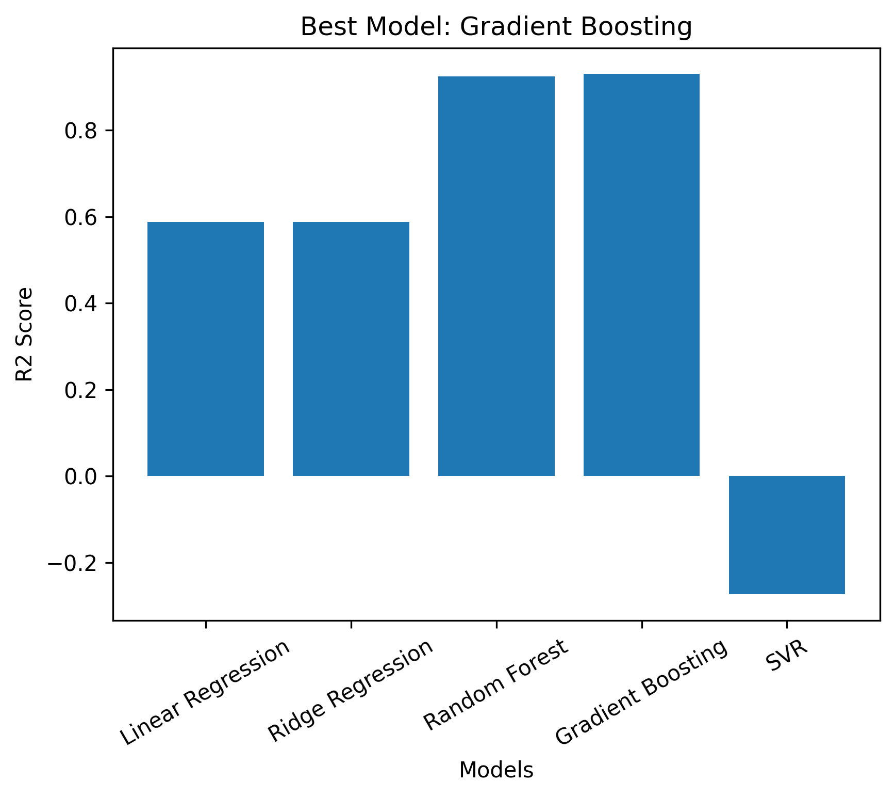

# Data Generation using Modelling and Simulation for Machine Learning

**Author:** Saksham Singh 
**Roll No:** 102303157

---

## 📌 Objective
The objective of this assignment is to generate a synthetic dataset using a simulation-based modeling approach and apply multiple machine learning models to analyze and predict system performance. The goal is to identify the best-performing ML model based on evaluation metrics.

---

## Simulation Tool Used
**SimPy (Python Discrete Event Simulation Library)**

SimPy is used to model a **single-server queue system**, representing real-world systems such as banks or call centers, where customers arrive randomly and are served by a single server.

---

##  Project Files
- `sim_assignment.ipynb` – Google Colab notebook
- `simulation_dataset.csv` – Generated dataset
- `model_r2_scores.png` – Result visualization

---

##  Methodology / Steps Followed

### Step 1: Simulator Selection
- Chose **SimPy**, a Python-based discrete event simulation library.

### Step 2: Installation and Exploration
- Installed SimPy in Google Colab.
- Studied queue-based simulation behavior.

### Step 3: Parameter Identification
The following parameters were used with defined bounds:

| Parameter | Description | Lower Bound | Upper Bound |
|---------|-------------|-------------|-------------|
| Arrival Rate | Customer arrival frequency | 0.5 | 5.0 |
| Service Rate | Service speed | 0.6 | 6.0 |
| Simulation Time | Total simulation duration | 50 | 200 |

### Step 4: Data Generation
- Random values of parameters were generated.
- These values were passed to the simulator.
- Performance metrics were recorded.

### Step 5: Simulation Runs
- **1000 simulations** were executed.
- A dataset was generated containing both input parameters and output metrics.

### Step 6: Machine Learning Model Comparison
The following ML models were trained to predict **average waiting time**:
- Linear Regression
- Ridge Regression
- Random Forest Regressor
- **Gradient Boosting Regressor**
- Support Vector Regressor (SVR)

Evaluation metrics used:
- R² Score
- RMSE
- MAE

---

## 📊 Results

### Best Model Performance Visualization
The following graph compares the performance of different ML models based on R² score:

Based on the evaluation metrics, **Gradient Boosting Regressor** achieved the highest R² score along with low RMSE and MAE values, making it the best-performing model.

---

## ✅ Conclusion
This assignment demonstrates the effectiveness of simulation-based data generation for machine learning applications. Among the evaluated models, the **Gradient Boosting Regressor** performed best due to its strong ability to model complex, non-linear relationships between simulation parameters and system performance metrics. This highlights the importance of ensemble learning techniques in predictive modeling tasks.

---

